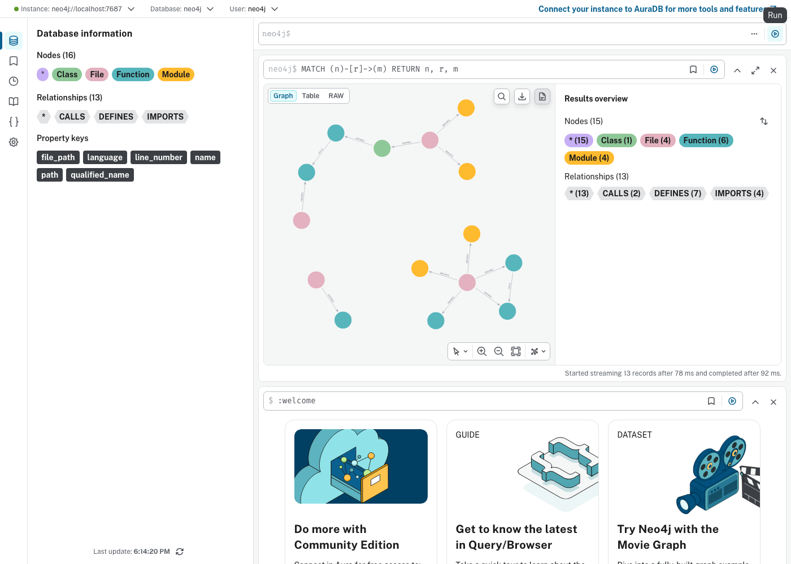

# RepoMindMCP

[](https://github.com/kartik117/RepoMindMCP/actions/workflows/ci.yml)

Parses a GitHub repo into a Neo4j knowledge graph — functions, classes, files, calls, imports, inheritance — and exposes it as an MCP server, so Claude Desktop and Cursor can answer structural questions about a codebase ("what calls X", "what does Y inherit from") grounded in the actual graph instead of a guess.



## Architecture

Two services, deliberately split by language rather than one Python app doing everything:

```
                    ┌─────────────────────────────┐
Claude Desktop /    │   mcp-server (TypeScript)    │
Cursor  ──stdio──>  │   the MCP protocol adapter   │
                    └──────────────┬───────────────┘
                                   │ HTTP
                    ┌──────────────▼───────────────┐
                    │   backend (Python)            │
                    │   clone → parse → graph       │
                    │   (ast / tree-sitter, Neo4j)   │
                    │   NL question → Cypher → answer│
                    └──────────────┬───────────────┘
                                   │ bolt
                    ┌──────────────▼───────────────┐
                    │   Neo4j                       │
                    └────────────────────────────────┘
```

The MCP server owns nothing but the protocol handshake and three thin tool wrappers. All the real work — AST/tree-sitter parsing, the graph schema, the NL-to-Cypher chain — lives in the Python backend, called over plain HTTP. This is a genuine, common production pattern (core logic in one language, a protocol-specific adapter in whatever SDK fits that protocol best), not a stack picked for the sake of looking polyglot.

## Verified for real

This claim — "ask a natural-language question, get an answer grounded in the graph" — was checked against a live Gemini call, not just unit tests: asking *"What functions are defined in this codebase?"* against the ingested [pypa/sampleproject](https://github.com/pypa/sampleproject) repo, the LLM generated

```cypher
MATCH (f:Function) RETURN f.qualified_name, f.file_path, f.line_number LIMIT 25
```

— correct, schema-respecting Cypher — and it ran successfully against the real graph. Ingestion also correctly resolved a **cross-file** `CALLS` edge (a test file calling a function defined in a completely different module), which is exactly what the two-pass graph-write strategy (structure first, relationships second) exists to handle.

## Stack

Python (FastAPI, tree-sitter, Neo4j driver, Gemini) · TypeScript (`@modelcontextprotocol/sdk`) · Neo4j · Docker

## Running it

**Neo4j + backend (Docker):**

```bash
cp backend/.env.example backend/.env   # add your GOOGLE_API_KEY
docker compose up --build
```

API on `localhost:8000`, Neo4j Browser on `localhost:7474`.

**MCP server:**

```bash
cd mcp-server
npm install && npm run build
```

Then add it to Claude Desktop / Cursor's MCP config — see [`mcp-server/README.md`](mcp-server/README.md).

**Try it without an MCP client**, straight against the API:

```bash
curl -X POST localhost:8000/ingest -H "Content-Type: application/json" \
  -d '{"repo_url": "https://github.com/pypa/sampleproject.git"}'
curl -X POST localhost:8000/query -H "Content-Type: application/json" \
  -d '{"question": "what functions are defined?"}'
```

## Testing

```bash
cd backend && pip install -e ".[dev]" && pytest && ruff check .   # needs Neo4j up; see CI for the service-container version
cd mcp-server && npm test && npm run build
```

## Engineering notes

- **JS and TypeScript's tree-sitter grammars represent class inheritance differently.** Plain JS nests the base class identifier directly under `class_heritage`; TypeScript's grammar adds an extra `extends_clause` level in between. Found by parsing the exact same source with both grammars side by side and comparing the trees, not by assuming one grammar generalizes to the other — fixed with a recursive descendant search instead of a direct-children check.
- **A real Cypher footgun**: chaining plain `MATCH` clauses with `WITH` to accumulate several counts returns *no row at all* if any single pattern has zero matches — a fresh graph with files but no `CALLS` edges yet returned nothing, not zeros, and `.single()` crashed on `None`. Fixed with independent `COUNT { }` subqueries, which return zero correctly on their own.
- **CI failed in a way local testing couldn't catch**: `NLToCypherChain.__init__` constructed the real Gemini client eagerly, which validates the API key immediately — and the FastAPI lifespan constructs that chain at startup. CI has no Gemini key (deliberately — every run would burn real quota against the 20-requests/day free tier), so the backend failed to *start*, not just failed to answer a query. Made LLM client construction lazy, deferred into the same try/except that already handles rate-limit failures gracefully.
- **The MCP SDK's tool-registration API has moved past several deprecated overloads.** Verified the current `registerTool(name, config, callback)` shape, the `ToolCallback` result type, and the stdio transport classes directly against the installed package's `.d.ts` files rather than relying on possibly-stale training knowledge — then verified the whole thing again by spawning the compiled server as a real child process and driving it with the SDK's own `Client` + `StdioClientTransport`, the same path Claude Desktop takes.
- **Dockerizing the backend needs the actual `git` binary**, not just the `gitpython` package — gitpython is a thin wrapper around the CLI, it doesn't reimplement it.
- **Neo4j AuraDB and Databricks both needed a personal signup** I couldn't do on the user's behalf; both projects in this series run their respective services locally via Docker instead.

## License

MIT
